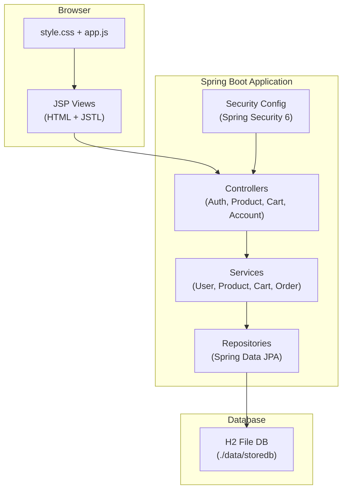
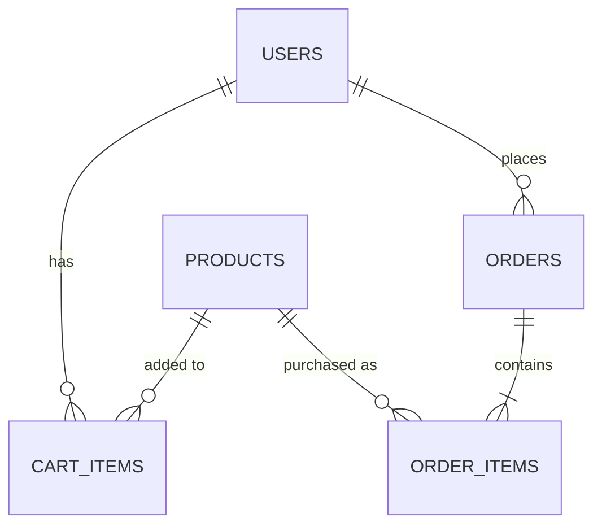
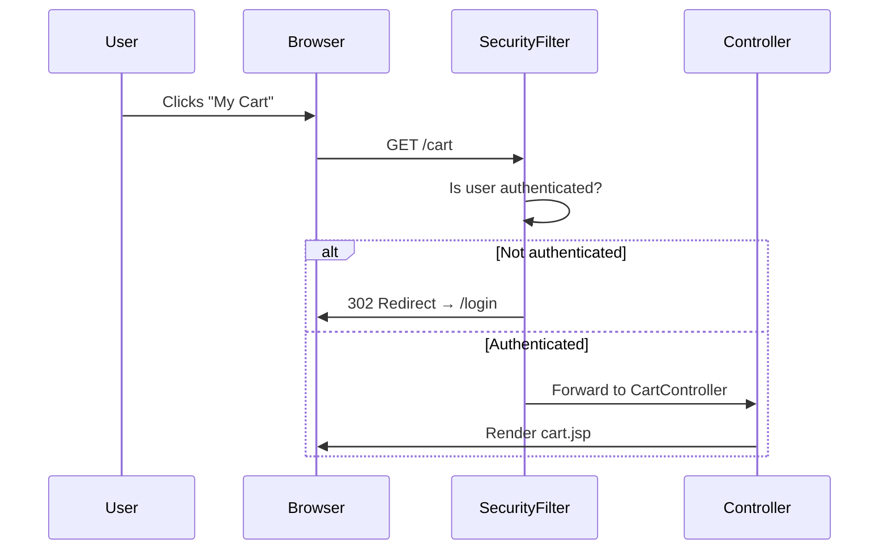

# 🛒 Online Store — Complete Project Walkthrough

## Overview

This is a **Java full-stack e-commerce web application** built as a hackathon project. It uses a clean **MVC (Model-View-Controller)** architecture with Spring Boot on the backend and JSP views rendered server-side.

---

## 🏗️ Architecture Diagram



---

## 📁 Project Structure Explained

### 🔧 Build & Config

| File | Purpose |
|------|---------|
| [pom.xml](file:///D:/clg/Hackathons'26/Java/pom.xml) | Maven build config — defines all dependencies (Spring Boot 3.3.1, Security, JPA, H2, Lombok, JSP/JSTL) |
| [application.properties](file:///D:/clg/Hackathons'26/Java/src/main/resources/application.properties) | Server port (8080), H2 file DB URL, JPA/Hibernate settings, JSP view resolver prefix/suffix |
| [.gitignore](file:///D:/clg/Hackathons'26/Java/.gitignore) | Ignores `target/`, `data/`, IDE files, compiled classes |

---

### 🚀 Entry Point

| File | Purpose |
|------|---------|
| [OnlineStoreApplication.java](file:///D:/clg/Hackathons'26/Java/src/main/java/com/store/OnlineStoreApplication.java) | The `@SpringBootApplication` main class — boots the embedded Tomcat server and Spring context |

---

### ⚙️ Config Layer

| File | Purpose |
|------|---------|
| [SecurityConfig.java](file:///D:/clg/Hackathons'26/Java/src/main/java/com/store/config/SecurityConfig.java) | Spring Security 6 configuration — defines which routes are public (`/`, `/index`, `/login`, `/register`, `/product`) and which require auth (`/cart`, `/account`). Configures form-based login, BCrypt password encoding, and logout behavior |

> [!IMPORTANT]
> The `dispatcherTypeMatchers(FORWARD, ERROR).permitAll()` line is critical — without it, Spring Security blocks internal JSP forwards causing infinite redirect loops.

---

### 🎮 Controller Layer (Handles HTTP Requests)

| File | Routes | Purpose |
|------|--------|---------|
| [AuthController.java](file:///D:/clg/Hackathons'26/Java/src/main/java/com/store/controller/AuthController.java) | `GET/POST /login`, `GET/POST /register` | Shows login/register forms, processes registration (BCrypt hash), delegates login to Spring Security |
| [ProductController.java](file:///D:/clg/Hackathons'26/Java/src/main/java/com/store/controller/ProductController.java) | `GET /`, `GET /index`, `GET /product` | Home catalog page with search + category filter, product detail page |
| [CartController.java](file:///D:/clg/Hackathons'26/Java/src/main/java/com/store/controller/CartController.java) | `GET /cart`, `POST /cart/add`, `POST /cart/remove`, `POST /cart/checkout` | Shopping cart CRUD + checkout (converts cart → order, then redirects to account page) |
| [AccountController.java](file:///D:/clg/Hackathons'26/Java/src/main/java/com/store/controller/AccountController.java) | `GET /account` | Displays user profile details (username, email, role) and order history |

---

### 📦 Entity Layer (JPA Database Models)

| File | Table | Key Fields |
|------|-------|------------|
| [User.java](file:///D:/clg/Hackathons'26/Java/src/main/java/com/store/entity/User.java) | `users` | id, username, email, password (BCrypt), role |
| [Product.java](file:///D:/clg/Hackathons'26/Java/src/main/java/com/store/entity/Product.java) | `products` | id, name, description, price, category, imageUrl |
| [CartItem.java](file:///D:/clg/Hackathons'26/Java/src/main/java/com/store/entity/CartItem.java) | `cart_items` | id, user (FK), product (FK), quantity |
| [Order.java](file:///D:/clg/Hackathons'26/Java/src/main/java/com/store/entity/Order.java) | `orders` | id, user (FK), totalPrice, orderDate, status |
| [OrderItem.java](file:///D:/clg/Hackathons'26/Java/src/main/java/com/store/entity/OrderItem.java) | `order_items` | id, order (FK), product (FK), price, quantity |



---

### 🗃️ Repository Layer (Database Access)

| File | Key Methods |
|------|-------------|
| [UserRepository.java](file:///D:/clg/Hackathons'26/Java/src/main/java/com/store/repository/UserRepository.java) | `findByUsername()`, `existsByUsername()`, `existsByEmail()` |
| [ProductRepository.java](file:///D:/clg/Hackathons'26/Java/src/main/java/com/store/repository/ProductRepository.java) | `findByCategory()`, `searchProducts()` (JPQL name/description LIKE), `searchProductsByCategory()` |
| [CartItemRepository.java](file:///D:/clg/Hackathons'26/Java/src/main/java/com/store/repository/CartItemRepository.java) | `findByUser()`, `findByUserAndProduct()` |
| [OrderRepository.java](file:///D:/clg/Hackathons'26/Java/src/main/java/com/store/repository/OrderRepository.java) | `findByUserOrderByOrderDateDesc()` |
| [OrderItemRepository.java](file:///D:/clg/Hackathons'26/Java/src/main/java/com/store/repository/OrderItemRepository.java) | Standard CRUD |

---

### 🔄 Service Layer (Business Logic)

| File | Key Responsibility |
|------|-------------------|
| [UserService.java](file:///D:/clg/Hackathons'26/Java/src/main/java/com/store/service/UserService.java) | Implements `UserDetailsService` for Spring Security. Handles user lookup, registration validation |
| [ProductService.java](file:///D:/clg/Hackathons'26/Java/src/main/java/com/store/service/ProductService.java) | Product search with optional category + text query combo filtering |
| [CartService.java](file:///D:/clg/Hackathons'26/Java/src/main/java/com/store/service/CartService.java) | Add to cart (increments quantity if exists), remove from cart |
| [OrderService.java](file:///D:/clg/Hackathons'26/Java/src/main/java/com/store/service/OrderService.java) | **Checkout flow**: reads all cart items → creates Order + OrderItems (snapshots price at purchase) → clears the cart |

---

### 🌱 Data Seeding

| File | Purpose |
|------|---------|
| [DatabaseSeeder.java](file:///D:/clg/Hackathons'26/Java/src/main/java/com/store/util/DatabaseSeeder.java) | `CommandLineRunner` that seeds 4 demo products (Electronics, Clothing, Home & Kitchen, Sports) on first startup when the DB is empty |

---

### 🎨 Frontend (Views + Assets)

#### JSP Templates

| File | Page | Description |
|------|------|-------------|
| [header.jsp](file:///D:/clg/Hackathons'26/Java/src/main/webapp/WEB-INF/jsp/header.jsp) | Shared | HTML head, nav bar (Browse, My Cart with badge, My Account, Theme Toggle, Login/Logout) |
| [footer.jsp](file:///D:/clg/Hackathons'26/Java/src/main/webapp/WEB-INF/jsp/footer.jsp) | Shared | Footer with copyright, closes `</main>`, `</body>`, `</html>` |
| [login.jsp](file:///D:/clg/Hackathons'26/Java/src/main/webapp/WEB-INF/jsp/login.jsp) | `/login` | Centered login form with error message display |
| [register.jsp](file:///D:/clg/Hackathons'26/Java/src/main/webapp/WEB-INF/jsp/register.jsp) | `/register` | Registration form (username, email, password, confirm password) |
| [index.jsp](file:///D:/clg/Hackathons'26/Java/src/main/webapp/WEB-INF/jsp/index.jsp) | `/index` | Search bar, category pills, promo banner, product card grid |
| [product.jsp](file:///D:/clg/Hackathons'26/Java/src/main/webapp/WEB-INF/jsp/product.jsp) | `/product?id=N` | Two-column layout (image + info), full-width description & highlights |
| [cart.jsp](file:///D:/clg/Hackathons'26/Java/src/main/webapp/WEB-INF/jsp/cart.jsp) | `/cart` | Cart items list, remove/save buttons, total, checkout button |
| [account.jsp](file:///D:/clg/Hackathons'26/Java/src/main/webapp/WEB-INF/jsp/account.jsp) | `/account` | Account details grid + order history cards |

#### Static Assets

| File | Purpose |
|------|---------|
| [style.css](file:///D:/clg/Hackathons'26/Java/src/main/resources/static/css/style.css) | Complete design system — CSS variables for dark/light mode, glassmorphism cards, Royal Violet accent, responsive grid layouts, animations |
| [app.js](file:///D:/clg/Hackathons'26/Java/src/main/resources/static/js/app.js) | Theme toggle (persists to localStorage), toast notification auto-dismiss |

---

## 🔐 Security Flow



**Public routes**: `/`, `/index`, `/login`, `/register`, `/product`, static assets
**Protected routes**: `/cart/**`, `/account/**`

---

## 🎨 Design System

- **Font**: Outfit (Google Fonts)
- **Accent Color**: Royal Violet (`#8b5cf6` dark / `#7c3aed` light)
- **Modes**: Dark (default) + Light — toggled via button, persisted in `localStorage`
- **Effects**: Glassmorphism (backdrop-blur), hover lift on cards, gradient backgrounds, glow shadows
- **Layout**: CSS Grid for product cards + product detail, Flexbox for header/footer

---

## 🧪 How to Run

```bash
# Prerequisites: Java 17+, Maven

# Start the server
mvn spring-boot:run

# Open browser
http://localhost:8080

# H2 Console (database viewer)
http://localhost:8080/h2-console
# JDBC URL: jdbc:h2:file:./data/storedb
# User: sa | Password: (empty)
```

---

## 📊 User Flows Summary

| Flow | Steps |
|------|-------|
| **Browse** | Home → Search/Filter → Product Detail |
| **Purchase** | Product Detail → Add to Cart → Cart Page → Checkout → Account (Order History) |
| **Auth** | Register → Login → Access Cart/Account |
| **Theme** | Click ☀️/🌙 button → Toggles dark/light mode (persisted) |
